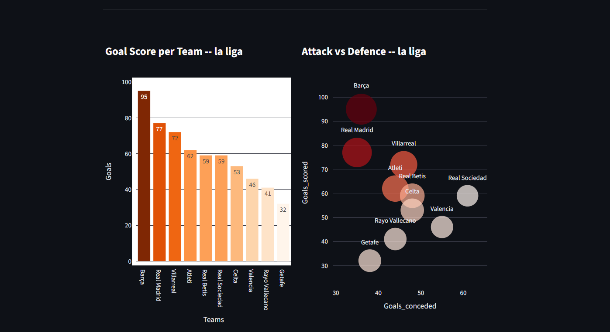
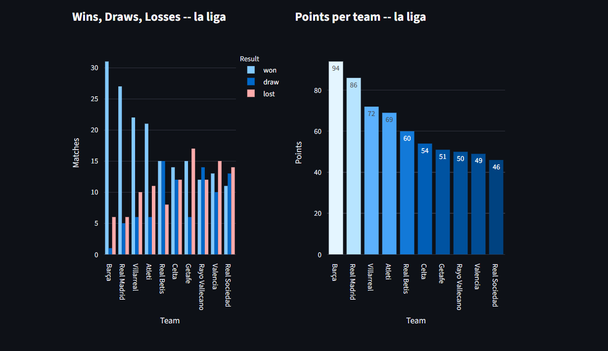

# Big Five Analytics

An interactive football analytics dashboard built with Python and Streamlit. Select any of Europe's Big Five leagues and instantly see a visual breakdown of the top 10 teams across four charts.

---
>[Live Demo](https://big-five-analytics.streamlit.app)

## Screenshots




---

## Features

- Select from Europe's Big Five leagues (Premier League, La Liga, Bundesliga, Serie A, Ligue 1)
- Live data fetched from the [football-data.org](https://www.football-data.org/) API
- Four interactive charts powered by Plotly:
  - Goals scored per team
  - Points per team
  - Wins, draws and losses per team
  - Attack vs defence scatter plot 
- Clean two-column dashboard layout
- Data cleaned and structured with pandas

---

## Tech Stack

`Python` `Streamlit` `Plotly` `Pandas` `Requests` `python-dotenv`

---

## Getting Started

### Prerequisites

- Python 3.8 or higher
- A free API token from [football-data.org](https://www.football-data.org/)

### Installation

1. Clone the repository

```bash
git clone https://github.com/Mahanaliyari/big-five-analytics.git
cd big-five-analytics
```

2. Install dependencies

```bash
pip install -r requirements.txt
```

3. Create a `.env` file in the root of the project and add your API token

```
API_TOKEN=your_token_here
```

4. Run the app

```bash
streamlit run app.py
```

---

## Project Structure

```
big-five-analytics/
├── app.py            # Streamlit app — layout, charts, user input
├── fetch_data.py     # Fetches league standings from football-data.org
├── clean_data.py     # Cleans and structures raw JSON into a DataFrame
├── .env              # API token 
├── .gitignore
└── requirements.txt
```

---

## Getting an API Token

1. Go to [football-data.org](https://www.football-data.org/)
2. Click **Get Started** on the free tier
3. Register with your email
4. Your API token will be emailed to you

---

## Future Improvements

- Expand from top 10 to all teams in the league
- Add a team-specific view with individual performance stats
- Include a season selector to compare across multiple seasons

